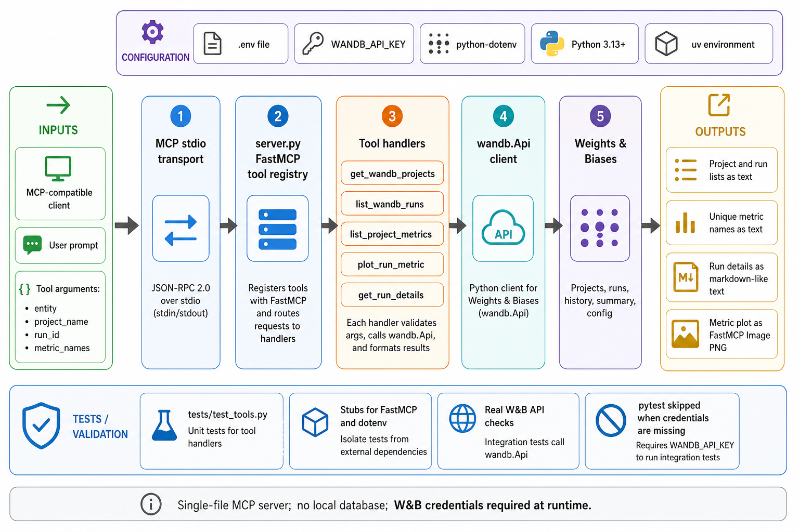

<div align="center">
  

  <h1>mcp-wandb</h1>

  **🔬 Query your Weights & Biases experiments directly from LLM agents via Model Context Protocol 📊**
</div>

mcp-wandb is a small Model Context Protocol server for querying Weights & Biases from MCP-compatible clients. It exposes W&B projects, runs, metrics, run details, and metric plots as FastMCP tools over stdio.

Use it when you want an agent to inspect experiment data without switching to the W&B dashboard or hand-copying run metadata.

## Install

```bash
git clone https://github.com/tsilva/mcp-wandb.git
cd mcp-wandb
uv sync
export WANDB_API_KEY=your_api_key
python server.py
```

Configure your MCP client to run the repo's `server.py` file, then restart the client.

```json
{
  "mcpServers": {
    "wandb": {
      "command": "python",
      "args": ["/path/to/mcp-wandb/server.py"],
      "env": {
        "WANDB_API_KEY": "your_api_key"
      }
    }
  }
}
```

## Commands

```bash
uv sync           # install dependencies into the local uv environment
python server.py  # run the MCP server over stdio
pytest tests/     # run tests; W&B credentials are required for live API checks
```

## Tools

- `get_wandb_projects(entity)` lists projects for a W&B entity.
- `list_wandb_runs(entity, project_name)` lists run names, IDs, and states.
- `list_project_metrics(entity, project_name)` returns metric names found across runs.
- `plot_run_metric(entity, project_name, run_id, metric_names)` returns a PNG metric plot as a FastMCP image.
- `get_run_details(entity, project_name, run_id)` returns overview, config, summary, and system metadata.

## Notes

- Python 3.13 or newer is required.
- `WANDB_API_KEY` must be set in the environment, or in a `.env` file loaded by `python-dotenv`.
- The server uses `wandb.Api` directly and does not keep a local database.
- Tests call the real W&B API and skip when required credentials or test project variables are missing.
- Live test variables are `TEST_WANDB_ENTITY`, `TEST_WANDB_PROJECT`, `TEST_WANDB_RUN_ID`, and `TEST_WANDB_METRICS`.

## Architecture



## License

[MIT](LICENSE)
