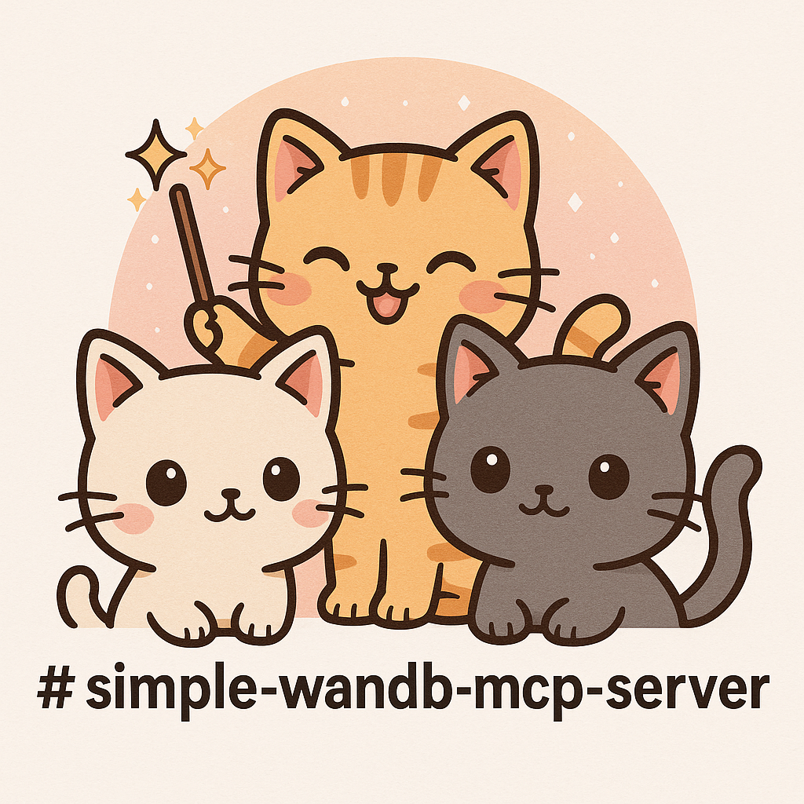

<div align="center">
  

  # mcp-wandb

  [](https://www.python.org/downloads/)
  [](https://opensource.org/licenses/MIT)
  [](https://modelcontextprotocol.io/)
  [](https://wandb.ai/)

  **🔬 Query your Weights & Biases experiments directly from LLM agents via Model Context Protocol 📊**

  [W&B Documentation](https://docs.wandb.ai/) · [MCP Specification](https://modelcontextprotocol.io/) · [Get API Key](https://wandb.ai/settings)
</div>

---

## Overview

Training a model is only half the work — understanding what happened requires digging through the W&B dashboard, switching context, and manually correlating runs. **mcp-wandb** eliminates that friction.

It's a Model Context Protocol (MCP) server that exposes Weights & Biases as LLM-native tools. Ask your AI agent to query projects, compare runs, surface metrics, or generate plots — all without leaving your workflow.

**Built with [FastMCP](https://github.com/jlowin/fastmcp)**, it runs as a lightweight stdio server that any MCP-compatible client (Claude Desktop, Cursor, etc.) can connect to in seconds.

## Features

- **List projects** — Get all W&B projects for any entity ⚡
- **Browse runs** — List runs with name, ID, and state at a glance 📋
- **Discover metrics** — Find unique metric names logged across all runs 🔍
- **Plot metrics** — Generate PNG visualizations of run metrics, returned as base64 📈
- **Run details** — Retrieve comprehensive run info: config, summary, and system metrics 🧪

## Quick Start

```bash
# Clone and install
git clone https://github.com/tsilva/mcp-wandb.git
cd mcp-wandb
uv sync
```

Set your W&B API key:

```bash
export WANDB_API_KEY=your_api_key
# Or use a .env file
echo "WANDB_API_KEY=your_api_key" > .env
```

Run the server:

```bash
python server.py
```

## MCP Client Configuration

Add to your MCP client config (e.g., Claude Desktop `claude_desktop_config.json`):

```json
{
  "mcpServers": {
    "wandb": {
      "command": "python",
      "args": ["/path/to/mcp-wandb/server.py"],
      "env": {
        "WANDB_API_KEY": "your_api_key"
      }
    }
  }
}
```

Restart your client after updating the config.

## Available Tools

| Tool | Parameters | Description |
|------|------------|-------------|
| `get_wandb_projects` | `entity` | List all projects for a W&B entity |
| `list_wandb_runs` | `entity`, `project_name` | List all runs in a project |
| `list_project_metrics` | `entity`, `project_name` | Get unique metric names across all runs |
| `plot_run_metric` | `entity`, `project_name`, `run_id`, `metric_names` | Generate a PNG plot of specified metrics |
| `get_run_details` | `entity`, `project_name`, `run_id` | Get detailed run info (overview, config, summary, system metrics) |

## Example Usage

Once connected to an MCP client, ask your agent things like:

- *"List all my W&B projects"*
- *"Show me the runs in my training-experiments project"*
- *"What metrics are being logged in this project?"*
- *"Plot the loss and accuracy for run abc123"*
- *"Give me the full details of my latest run"*

## Requirements

- Python 3.13+
- A [Weights & Biases](https://wandb.ai/) account and API key
- An MCP-compatible client (Claude Desktop, Cursor, etc.)

## Development

```bash
# Install dependencies
uv sync

# Run tests (requires W&B credentials)
WANDB_API_KEY=<key> \
TEST_WANDB_ENTITY=<entity> \
TEST_WANDB_PROJECT=<project> \
TEST_WANDB_RUN_ID=<run_id> \
TEST_WANDB_METRICS=<metric1,metric2> \
pytest tests/
```

## License

MIT — see [LICENSE](LICENSE) for details.

## Author

[tsilva](https://github.com/tsilva)
